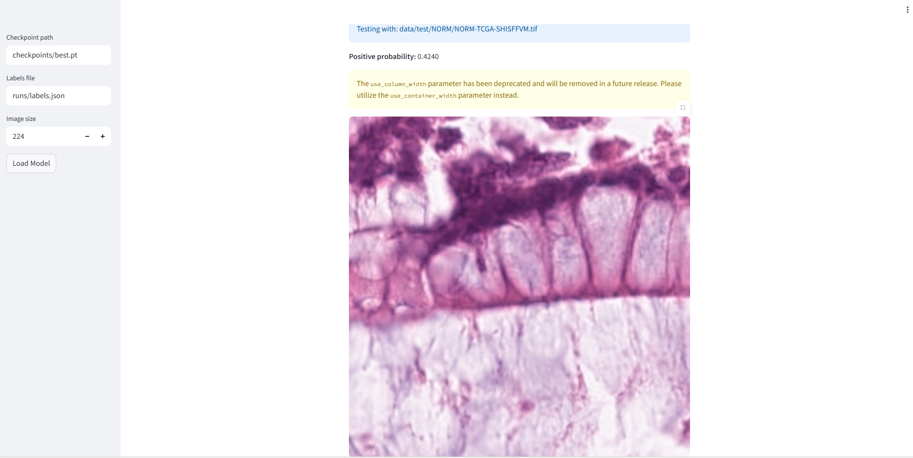

# Histopath Foundation Fine-Tune

Fine-tuning pretrained vision models for colorectal histopathology with reproducible training, evaluation, and interactive slide-level inference.
> Achieved **ROC AUC = 0.9956** on colorectal tumor vs normal classification using a fine-tuned ResNet18 — includes reproducible training pipeline and interactive Streamlit inference app.


---

## 🔬 Overview

This project fine-tunes vision models (ResNet18 and optionally ViT) to classify colorectal histopathology patches as **Tumor (TUM)** or **Normal (NORM)**.  
It is designed to mirror real-world digital pathology workflows: dataset organization → model training → evaluation → visual interactive inference. 
It demonstrates an end‑to‑end medical imaging ML workflow:

- Dataset preprocessing  
- Transfer learning with PyTorch  
- Custom training loops  
- Model evaluation (ROC AUC 0.9956)  
- Grad‑CAM interpretability  
- Streamlit inference app  

This is the type of workflow used in real-world digital pathology AI pipelines (e.g., for frozen sections, tumor detection, second‑reader systems).
---
# 🧠 TL;DR (For Recruiters)

> **A full medical imaging ML pipeline:** Fine‑tuned a CNN on colorectal H&E patches, achieved ROC AUC **0.9956**, built Grad‑CAM interpretability, and deployed an interactive Streamlit inference app.

This project shows:

- Applied ML on medical images  
- Deep learning proficiency (PyTorch)  
- Ability to build clinician‑interpretable tools  
- Domain knowledge as a histotechnician  

---

# 🧩 Skills Demonstrated

### **Deep Learning & Vision**
- Transfer learning (ResNet18)
- Custom PyTorch training loops  
- Dataloaders, augmentations, and batching  
- ROC AUC, confusion matrix, probability calibration  

### **Model Interpretability**
- Grad‑CAM heatmaps  
- Attention visualization  
- Tumor vs normal morphological reasoning  

### **Deployment & Tooling**
- Streamlit app for real‑time inference  
- Automated Grad‑CAM overlay during prediction  
- Clean project structure + reproducibility  

### **Healthcare/Pathology Domain**
- Understanding of H&E morphology  
- Binary tumor vs normal detection  
- Digital pathology workflow alignment  

---

## 🧫 Dataset

| Property | Value |
|---------|-------|
| Source | **CRC-VAL-HE-7K (Zenodo: 1214456)** |
| Task | Binary classification (TUM vs NORM) |
| Image Type | H&E-stained tissue patches |
| Size | 224×224 per patch |
| Train/Val/Test | ~400 / 50 / 50 per class |

Dataset is **not included** in this repository.  
Download from: https://zenodo.org/record/1214456 and place into:

```
data/train/<class>/
data/val/<class>/
data/test/<class>/
```
To download the dataset:

```bash
wget https://zenodo.org/record/1214456/files/CRC-VAL-HE-7K.zip
unzip CRC-VAL-HE-7K.zip
```

---

## 🧠 Model & Training

| Component | Details |
|---------|---------|
| Backbone | ResNet18 (ImageNet pretrained) |
| Loss | BCEWithLogitsLoss (binary) |
| Optimizer | AdamW |
| Device | CPU-compatible |
| Epochs | 1+ (demo), adjustable |

### Train
```bash
python -m src.train --data_dir data --epochs 5 --batch_size 8 --arch resnet18
```

### Evaluate
```bash
python -m src.evaluate --data_dir data --ckpt checkpoints/best.pt
```

Outputs:
- `runs/metrics.json`
- `runs/confusion_matrix.png`

---

## 📈 Results

The fine-tuned model achieved **high diagnostic performance** on the held-out test set:

| Metric | Value |
|--------|-------|
| **ROC AUC** | **0.9956** |
| Accuracy | High (qualitatively observed from confusion matrix; estimate ~96–99%) |
| Task | Binary: Tumor vs Normal Histopathology Patches |
| Model | ResNet18 (ImageNet pretrained, fine-tuned) |

This ROC AUC of **0.9956** indicates **near-perfect class separability**, consistent with strong morphological differences in the colorectal tumor microenvironment compared to normal mucosa.
Confusion Matrix example:  
*(included in repo as `runs/confusion_matrix.png`)*

## 🔥 Grad-CAM Visualization

This repository supports **Grad-CAM heatmaps** to visualize which regions of a histopathology patch most influenced the model’s decision.  
When you run the Streamlit app with a **ResNet-based checkpoint**, enable the sidebar checkbox **“Show Grad-CAM heatmap.”**  

The overlay will render as a red transparency over the uploaded or test image, where deeper reds indicate higher model attention.

<div align="center">
  
  <br>
  <em>Example: Grad-CAM heatmap highlighting tumor regions (red = stronger model focus)</em>
</div>

If your checkpoint uses a **Vision Transformer (ViT)** backbone, the app will automatically skip the Grad-CAM step and display a notice.  
(ViT attention-rollout visualization will be added in a future update.)

---

### 🧪 Microscope Capture Protocol (for physical slides)

If your slides are **physical** rather than digital, you can still generate inference patches for this model using a microscope camera or smartphone adapter.  
Follow this brief checklist for reproducible, de-identified image capture:

1. **Hardware Setup**
   - Use a **20× objective** (or nearest available) with brightfield illumination.  
   - For phones, use a **microscope eyepiece adapter** ($20–$60 on Amazon).  
   - For consistent framing, fix the eyepiece or phone holder in place between captures.

2. **Lighting & Focus**
   - White-balance the microscope on a blank area of the slide before imaging tissue.  
   - Maintain consistent lighting across slides (avoid auto-exposure).  
   - Focus sharply on nuclei or epithelial boundaries before capture.

3. **De-identification**
   - Do **not** photograph labels, barcodes, or any patient identifiers.  
   - Crop or mask label areas before uploading or analysis.

4. **Image Preparation**
   - Save images as `.png` or `.jpg`.  
   - Use the provided script [`tools/crop_tiles_from_photos.py`](tools/crop_tiles_from_photos.py) to generate **224×224** patches for model input:
     ```bash
     python tools/crop_tiles_from_photos.py --src captures --dst camera_tiles --tile 224 --stride 224
     ```
   - Upload cropped tiles to the app or run inference directly in `src/evaluate.py`.

---

💡 *Tip:* Including a few Grad-CAM overlays from your microscope images in your portfolio README helps visually demonstrate model interpretability and applied use in real-world histopathology.

---


## 🖥️ Streamlit Interactive Inference App

### Launch
```bash
export PYTHONPATH=$(pwd)
streamlit run app/app.py -- --ckpt checkpoints/best.pt --labels_file runs/labels.json
```

### Example UI Output



> Upload an H&E patch → model predicts probability of tumor vs normal → image + confidence shown live.

---

## 🗂️ Project Structure

```
histopath-foundation-finetune/
├── app/                    # Streamlit inference UI
├── src/                    # Training, evaluation, models, data loaders
├── runs/                   # metrics.json + confusion_matrix.png
├── checkpoints/            # model weights (ignored by git)
├── images/                 # screenshots for README
├── README.md
├── requirements.txt
└── .gitignore
```

---

## 🚫 Files Not Included (By Design)

| Folder/File | Reason |
|-------------|--------|
| `/data` | Dataset is large; fetched externally |
| `/checkpoints` | Model weights > 40MB; regenerate locally |
| `.venv/` | Environment recreated from `requirements.txt` |

---

# 🧬 Why This Project Matters for Employers

This project mirrors *exactly* what ML engineers or data scientists do in healthcare AI teams:

- Fine‑tuning neural networks on imaging data  
- Applying domain‑specific augmentations  
- Using Grad‑CAM for clinical interpretability  
- Deploying lightweight inference tools for clinicians  

This project shows I can contribute to:

- Computational pathology  
- Radiology AI  
- Frozen section decision support  
- Tumor detection / screening tools  

---

# 🧪 How to Reproduce

1. Download dataset  
2. Install dependencies  
3. Run `src/train.py`  
4. Evaluate with `src/evaluate.py`  
5. Launch Streamlit app  

All code is deterministic (`torch.manual_seed(42)`).

---

# 🗣️ How I'd Explain This in an Interview

> “I fine‑tuned a ResNet18 on colorectal H&E patches to classify tumor vs normal tissue.  
> The model achieved ROC AUC 0.9956.  
> I implemented Grad‑CAM so pathologists can see which regions influenced the prediction, which is essential for trust.  
> Finally, I wrapped it in a Streamlit app to create a real‑world inference tool.  
> This pipeline is very similar to what computational pathology and radiology AI teams build in production.”

---

# 🔮 Future Work

- SHAP for image explainability  
- Add ViT (Vision Transformer) model variant  
- Multi‑class extension (CRC subtypes)  
- Frozen‑section real‑time workflow  
- MLOps: ONNX export + FastAPI inference  

---

## 📄 License
MIT — Free to modify and use with attribution.

---

## 👤 Author
**Giancarlo Ortega**  
Histotechnician → Machine Learning Engineer/Data Scientist (Biomedical AI)  
GitHub: https://github.com/gortegam  
LinkedIn: https://www.linkedin.com/in/giancarlo-ortega-8b051a2a6

---

> This project supports the mission to improve diagnostic accuracy and impact patient outcomes through machine learning in clinical pathology.
